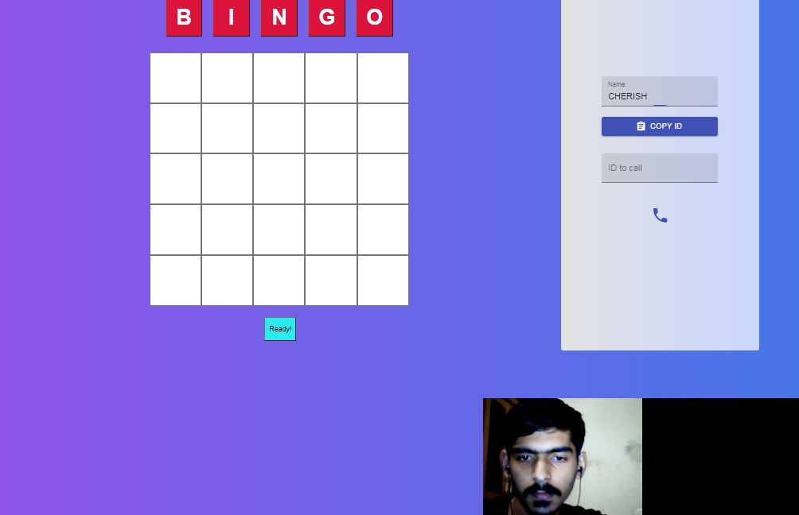
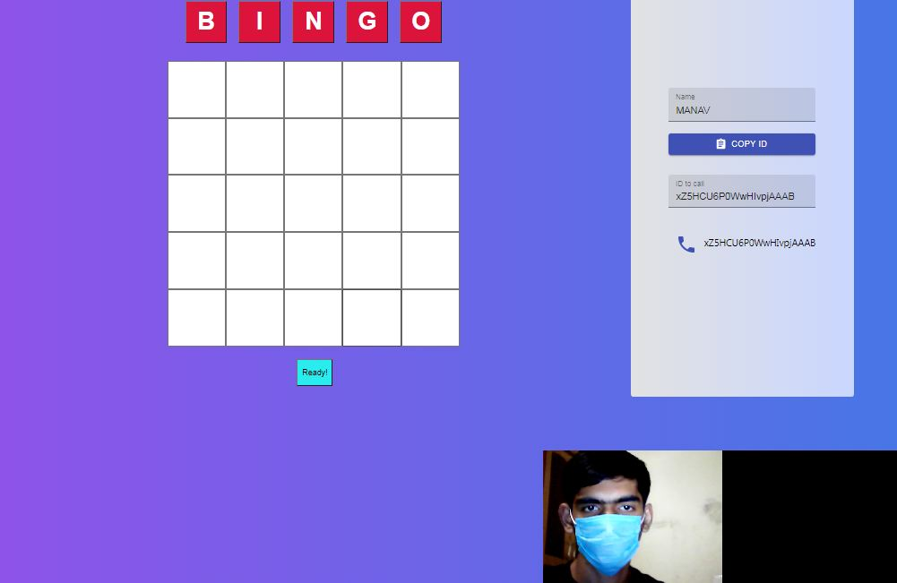
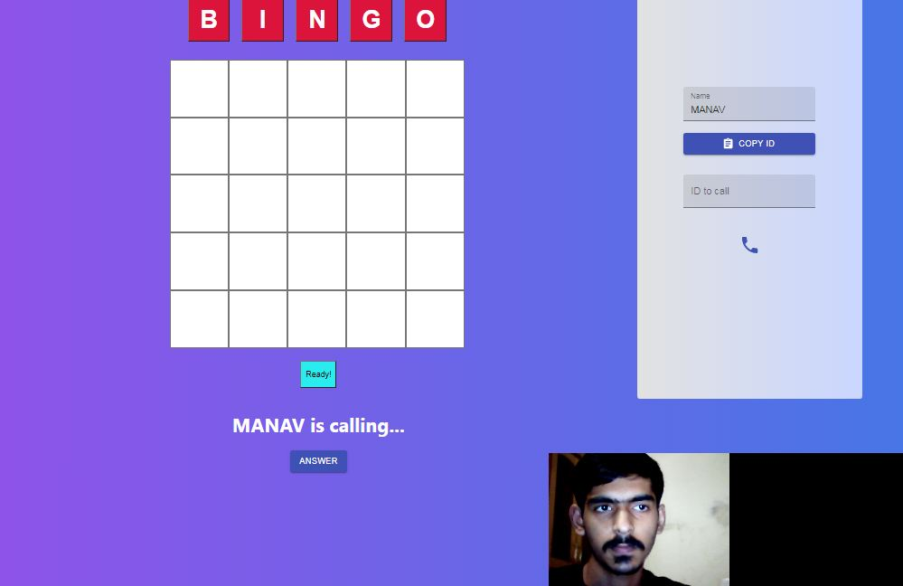
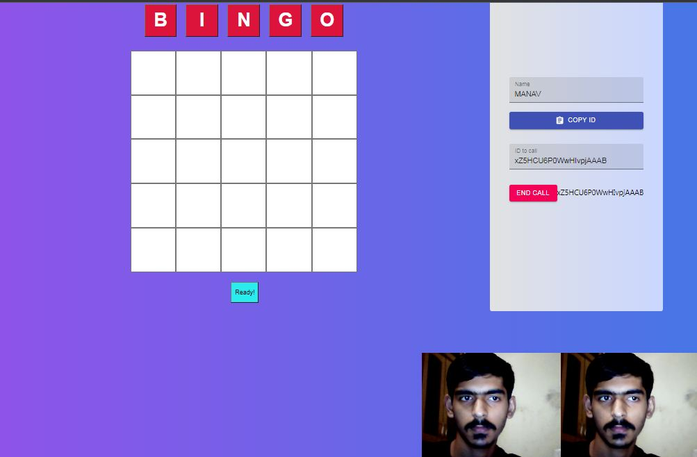
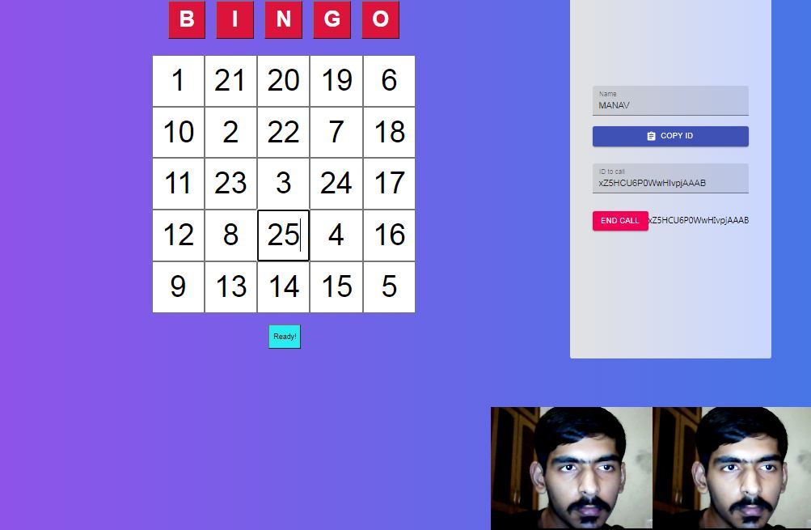
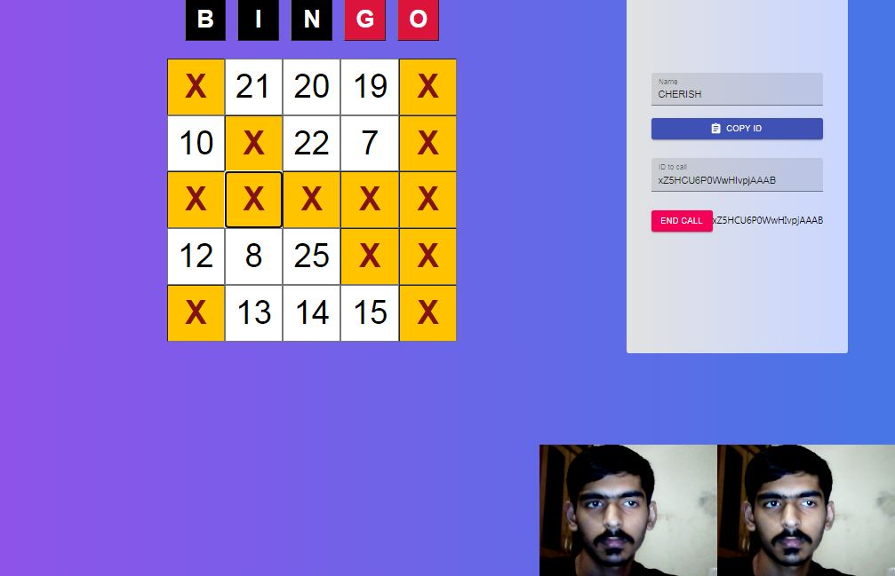
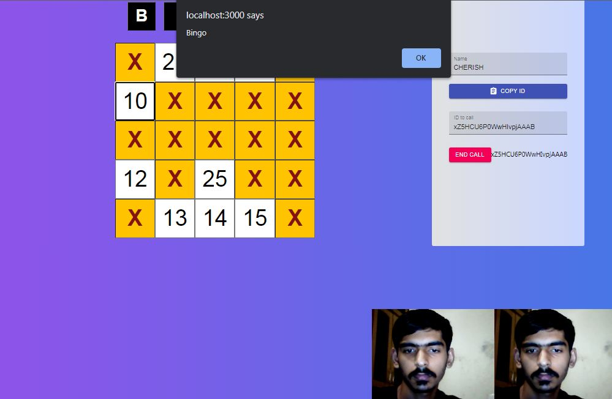

<h1 align="center">BINGO ONLINE</h1>
<h2 align="center">Two player online game of BINGO</h2>


## 🤔 What is Bingo?

A game in which players mark off numbers on cards as the numbers are called randomly between 1-25 by players, the winner being the first person to mark off 5 row/column/diagonal on card.


## ❓ About the Game

This two-player online version of the game was built with [React](https://reactjs.org/), [Socket.IO](https://socket.io/), [WebRTC](https://webrtc.org/), [Express](https://expressjs.com/) and [Node](https://nodejs.org/en/). It currently supports two-players in each game.


## 🧐 How to Play?

1. Once you're on the homepage of the game, you can copy the id and send it to your friend.
2. The friend will paste the id and will call you. Then you wil answer the call and both of your camera and audio will turn on.
4. That's it! Enjoy the game and remember, no toxicity!

## 🎮 Screenshots









## 🏁 Getting Started (to run game locally)

Follow the steps below, after cloning the repository:

### 🖐 Requirements

**For Installing:**

- Node

### ⏳ Installation

- Navigate into the server folder and use npm to install the server-side dependencies

```bash
npm install
```

This command installs all the server-side dependencies needed for the game to run locally.

- Use npm to run server

```bash
npm start
```

This command gets the server running on localhost port 5000.

- In a separate terminal, navigate into the client folder and use npm to install the client-side dependencies

```bash
cd client
npm install
```

This command installs all the client-side dependencies needed for the game to run locally.

- Finally, use npm to run client

```bash
npm start
```

This command gets the client running on localhost port 3000.

Head over to http://localhost:3000/ and enjoy the game! 🎉


## 🤝 Contributing

Contributions are what make the open source community such an amazing place to be learn, inspire, and create. Any contributions you make are greatly appreciated. The **Issues** tab is a good place to begin!

1. Fork the project repo
2. Clone the forked repo on your machine
3. Create your feature branch (`git checkout -b feature/AmazingFeature`)
4. Commit your changes (`git commit -m 'Add some AmazingFeature'`)
5. Push to the branch on your forked repo (`git push origin feature/AmazingFeature`)
6. Open a pull request


## ❤️ Acknowledgements

* [NikValdez ](https://github.com/NikValdez) for the WebRTC tutorial
